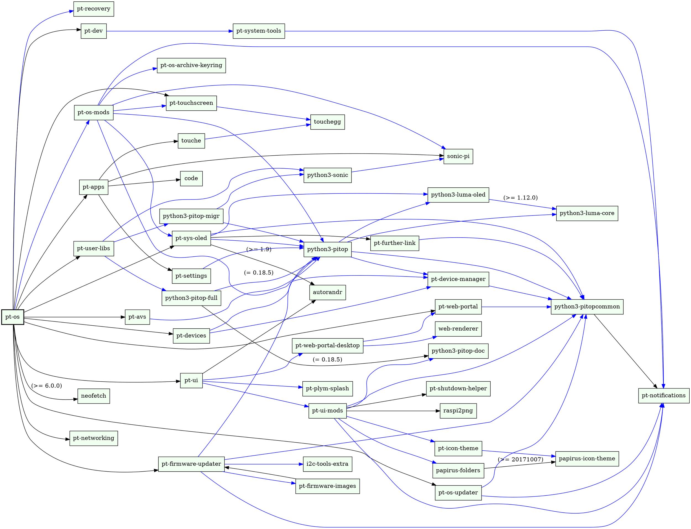

# Technical Details

## Dependency Graph

Below is a modified dependency graph of the `pt-os` top-level package that is installed on top of Raspberry Pi OS to produce pi-topOS:

## Table Of pi-top Software Packages

Here is an outline of how the packages are organized:

### Core Packages / System Management
* pt-os-core

### Theming
* pt-icon-theme
* pt-plym-splash
* pt-ui-mods

### Desktop
* pt-notifications
* pt-system-tools

### GUIs
* pt-shutdown-helper
* web-renderer

### Hardware
* i2c-tools-extra (Additional I2C utilities)
* pt-sys-oled
* pt-touchscreen

Here is a more comprehensive guide (work in progress) of the packages that currently comprise pi-topOS:

| Source Package           | Binary Package(s)                                             | Repository                                                
|--------------------------|---------------------------------------------------------------|-------------------------------------------------------------------|
| pt-avs                   | <ul><li>pt-avs</li></ul>                                      | [Link](https://github.com/pi-top/Alexa-Voice-Service-integration) |
| i2c-tools-extra          | <ul><li>i2c-tools-extra</li></ul>                             | [Link](https://github.com/pi-top/i2c-tools-extra)                 |
| luma.core                | <ul><li>python3-luma-core</li></ul>                           | [Link](https://github.com/pi-top/luma.core-deb)                   |
| luma.oled                | <ul><li>python3-luma-oled</li></ul>                           | [Link](https://github.com/pi-top/luma.oled-deb)                   |
| notify-send.sh           | <ul><li>notify-send-ng</li></ul>                              | [Link](https://github.com/pi-top/notify-send.sh-deb)              |
| raspi2png                | <ul><li>raspi2png</li></ul>                                   | [Link](https://github.com/pi-top/raspi2png)                       |
| py-pitop-common          | <ul><li>python3-pitopcommon</li></ul>                         | [Link](https://github.com/pi-top/pi-top-Python-Common-Library)    |
| py-pitop-sdk             | <ul><li>py-pitop-sdk</li><li>python3-pitop-full</li></ul>     | [Link](https://github.com/pi-top/pi-top-Python-SDK)               |
| pt-device-manager        | <ul><li>pt-device-manager</li></ul>                           |                                                                   |
| pt-display-port          | <ul><li>pt-display-port</li><li>pt-dp-usb-eth-gadget</li><li>pt-dp-dhcp-server</li></ul> |                                        |
| pt-firmware-images       | <ul><li>pt-firmware-images</li></ul>                          |                                                                   |
| pt-firmware-updater      | <ul><li>pt-firmware-updater</li></ul>                         |                                                                   |
| pt-further-link          | <ul><li>pt-further-link</li></ul>                             | [Link](https://github.com/pi-top/pt-further-link)                 |
| pt-icon-theme            | <ul><li>pt-icon-theme</li></ul>                               | [Link](https://github.com/pi-top/pt-icon-theme)                   |
| pt-networking            | <ul><li>pt-networking</li></ul>                               | [Link](https://github.com/pi-top/pt-os-core)                      |
| pt-os-core               | <ul><li>pt-os-core</li><li>pt-os</li><li>pt-apps</li><li>pt-dev</li><li>pt-devices</li><li>pt-ui</li><li>pt-user-libs</li><li>pt-os-archive-keyring</li><li>pi-top-4</li><li>pt-system-tools</li><li>pt-notifications</li></ul>                 |                                                                   |
| pt-os-mods               | <ul><li>pt-os-mods</li></ul>                                  |                                                                   |
| pt-plym-splash           | <ul><li>pt-plym-splash</li></ul>                              | [Link](https://github.com/pi-top/pt-plym-splash)                  |
| pt-recovery              | <ul><li>pt-recovery</li></ul>                                 |                                                                   |
| pt-shutdown-helper       | <ul><li>pt-shutdown-helper</li></ul>                          | [Link](https://github.com/pi-top/pt-shutdown-helper)              |
| pt-sys-oled              | <ul><li>pt-sys-oled</li></ul>                                 | [Link](https://github.com/pi-top/pt-sys-oled)                     |
| pt-touchscreen           | <ul><li>pt-touchscreen</li></ul>                              | [Link](https://github.com/pi-top/pt-touchscreen)                  |
| pt-ui-mods               | <ul><li>pt-ui-mods</li></ul>                                  | [Link](https://github.com/pi-top/pt-ui-mods)                      |
| pt-web-portal            | <ul><li>pt-web-portal</li><li>pt-web-portal-desktop</li></ul> |                                                                   |
| pt-wireless-access-point | <ul><li>pt-wireless-access-point</li></ul>                    |                                                                   |
| web-renderer             | <ul><li>web-renderer</li></ul>                                | [Link](https://github.com/pi-top/web-renderer)                    |

## OS build process

In addition to installing the `pt-os` package, which in turn installs all other pi-topOS packages, the following changes are made during OS builds:

* Change the default pi user password to `pi-top`
* Enable VNC Server by default
* Add pi-top software repository
* Force HDMI out of HDMI1 on Raspberry Pi 4 to allow for VNC without a connected display
* Force HDMI blanking
* Enable hardware interfaces (SPI, I2C) used by pi-tops by default to allow detection on first boot
* Enable extra video codecs in Raspberry Pi GPU firmware; adding native support for Raspberry Pi Camera
* Sette GPU memory allocation to 128MB
* Configure a DHCP server on pi-top [4]’s USB-OTG port
* Sette up dynamic swap for better performance
* Change hostname from 'raspberrypi' to 'pi-top'
Setting default locale and keyboard layout to US
* Customize color scheme, font and icons

## Device Drivers

TODO: how device manager, SDK, common library and pi-top hardware all work together

TODO: how pi-topOS software hot-loads kernel modules using `dtoverlay` and `dtparam` for hardware interfaces. how interfaces are enabled/disabled or handled automatically
* I2C
* UART - pi-topPULSE microphone
* SPI - pi-top [4] miniscreen
* I2S - pi-topPULSE and pi-topSPEAKER
    * pi-top [3]'s onboard HDMI-to-I2S conversion
    * enabling volume control with `hifiberry-alsactl.restore`

TODO: communication protocols (e.g. ZMQ, udev, systemd), which modules require them, why, and how to handle strange "gotchas".
